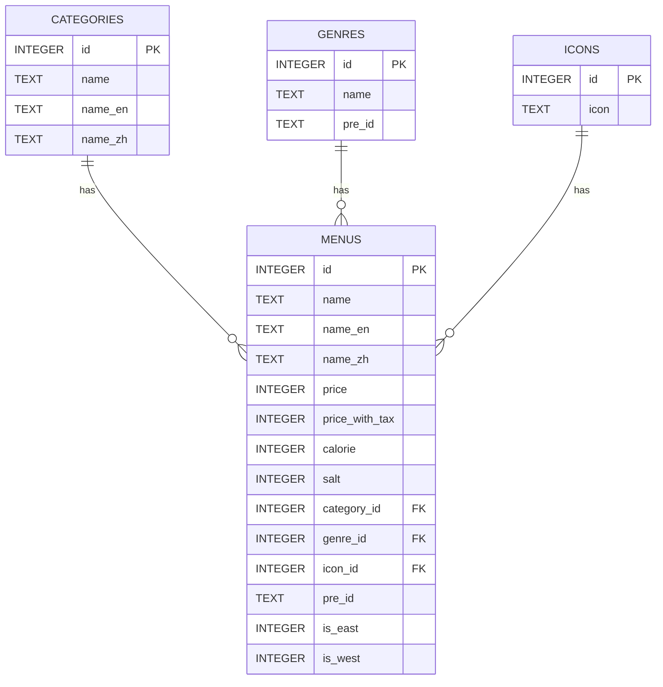

# データベース構成

## ER 図

## データ構造

### カテゴリマスタ (`categories`)

| KEY 名    | 説明               | データ型  | サンプル     |
| --------- | ------------------ | --------- | ------------ |
| `id`      | カテゴリ ID        | `INTEGER` | `1`          |
| `name`    | カテゴリ名         | `TEXT`    | `グランド`   |
| `name_en` | カテゴリ名(英語)   | `TEXT`    | `Grand Menu` |
| `name_zh` | カテゴリ名(中国語) | `TEXT`    | `主`         |

### ジャンルマスタ (`genres`)

| KEY 名   | 説明          | データ型  | サンプル |
| -------- | ------------- | --------- | -------- |
| `id`     | ジャンル ID   | `INTEGER` | `12`     |
| `name`   | ジャンル名    | `TEXT`    | `サラダ` |
| `pre_id` | 旧ジャンル ID | `TEXT`    | `SA`     |

### アイコンマスタ (`icons`)

| KEY 名 | 説明        | データ型  | サンプル |
| ------ | ----------- | --------- | -------- |
| `id`   | アイコン ID | `INTEGER` | `1`      |
| `icon` | アイコン    | `TEXT`    | `🥗`    |

### 商品マスタ (`menus`)

| KEY 名           | 説明                        | データ型  | サンプル         |
| ---------------- | --------------------------- | --------- | ---------------- |
| `id`             | メニュー ID                 | `INTEGER` | `1202`           |
| `name`           | メニュー名                  | `TEXT`    | `小エビのサラダ` |
| `name_en`        | メニュー名(英語)            | `TEXT`    | `Shrimp Salad`   |
| `name_zh`        | メニュー名(中国語)          | `TEXT`    | `小甜虾沙拉`     |
| `price`          | 税抜価格                    | `INTEGER` | `319`            |
| `price_with_tax` | 税込価格                    | `INTEGER` | `350`            |
| `calorie`        | エネルギー(カロリー) (kcal) | `INTEGER` | `192`            |
| `salt`           | 食塩相当量 (g)              | `INTEGER` | `1.5`            |
| `category_id`    | カテゴリ ID                 | `INTEGER` | `1`              |
| `genre_id`       | ジャンル ID                 | `INTEGER` | `12`             |
| `icon_id`        | アイコン ID                 | `INTEGER` | `6`              |
| `pre_id`         | 旧メニュー ID               | `TEXT`    | `SA02`           |
| `is_east`        | 全国対象フラグ              | `INTEGER` | `1`              |
| `is_west`        | 関西以西対象フラグ          | `INTEGER` | `1`              |
